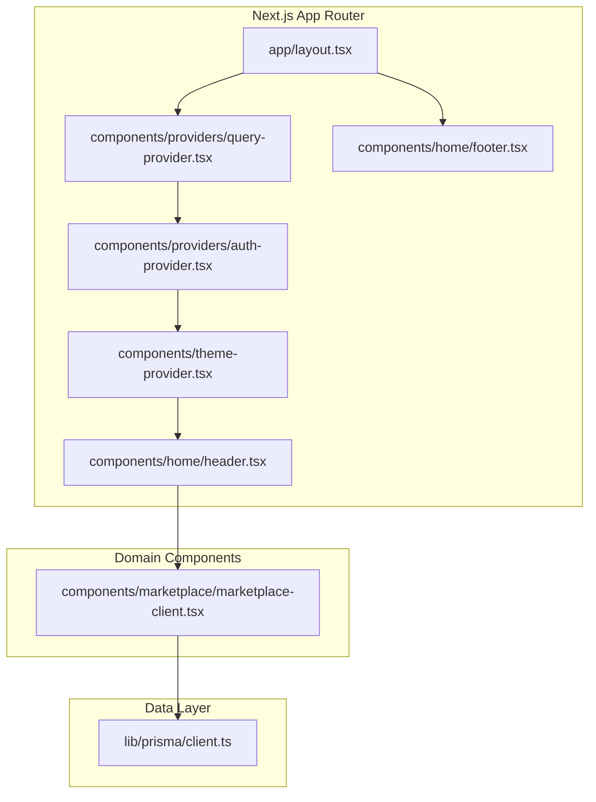
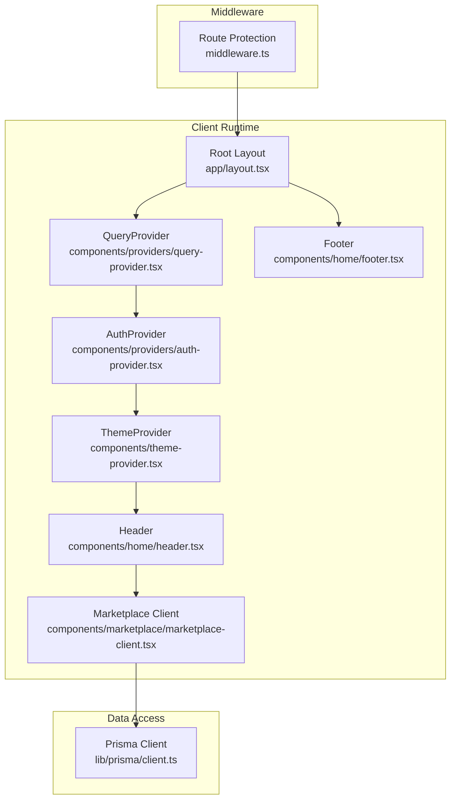
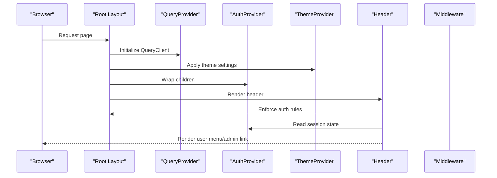
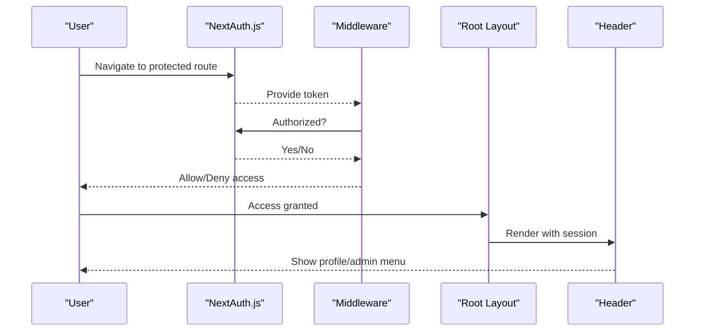
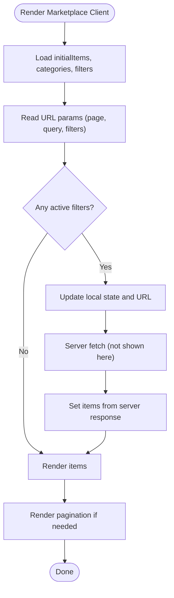
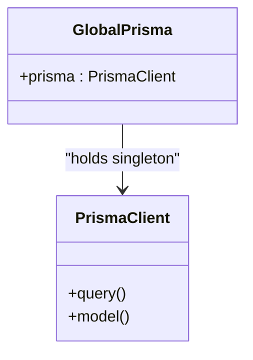
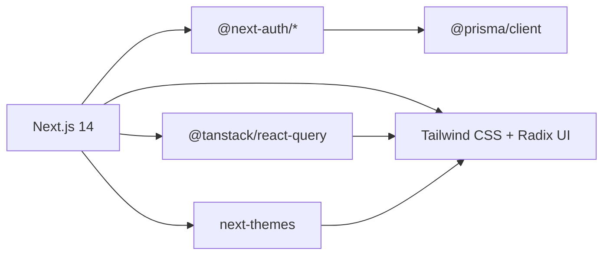

# Architecture Overview

<cite>
**Referenced Files in This Document**
- [app/layout.tsx](file://app/layout.tsx)
- [components/theme-provider.tsx](file://components/theme-provider.tsx)
- [components/providers/auth-provider.tsx](file://components/providers/auth-provider.tsx)
- [components/providers/query-provider.tsx](file://components/providers/query-provider.tsx)
- [middleware.ts](file://middleware.ts)
- [components/home/header.tsx](file://components/home/header.tsx)
- [components/home/footer.tsx](file://components/home/footer.tsx)
- [components/marketplace/marketplace-client.tsx](file://components/marketplace/marketplace-client.tsx)
- [lib/prisma/client.ts](file://lib/prisma/client.ts)
- [package.json](file://package.json)
</cite>

## Table of Contents
1. [Introduction](#introduction)
2. [Project Structure](#project-structure)
3. [Core Components](#core-components)
4. [Architecture Overview](#architecture-overview)
5. [Detailed Component Analysis](#detailed-component-analysis)
6. [Dependency Analysis](#dependency-analysis)
7. [Performance Considerations](#performance-considerations)
8. [Troubleshooting Guide](#troubleshooting-guide)
9. [Conclusion](#conclusion)

## Introduction
This document describes the Sendam Marketplace architecture built with Next.js 14 App Router. It explains the provider pattern for centralized state management, authentication, and theming; the separation of concerns across UI, business logic, and data access layers; and the system boundaries between the frontend, backend APIs, and external services. The technology stack includes React 18, TypeScript, Prisma ORM, NextAuth.js, and Tailwind CSS.

## Project Structure
The application follows Next.js 14’s App Router conventions:
- app/: Route handlers, pages, and shared layouts
- components/: Reusable UI and domain-specific components
- lib/: Shared utilities, database client, and typed schemas
- hooks/: Custom React hooks
- prisma/: Prisma schema and migrations
- public/: Static assets

Key architectural entry points:
- Root layout composes providers and renders shared UI (header, footer)
- Middleware enforces route-level authorization
- Providers encapsulate cross-cutting concerns (authentication, theming, query caching)

**Diagram sources**
- [app/layout.tsx:45-87](file://app/layout.tsx#L45-L87)
- [components/providers/query-provider.tsx:6-12](file://components/providers/query-provider.tsx#L6-L12)
- [components/providers/auth-provider.tsx:6-12](file://components/providers/auth-provider.tsx#L6-L12)
- [components/theme-provider.tsx:9-11](file://components/theme-provider.tsx#L9-L11)
- [components/home/header.tsx:20-195](file://components/home/header.tsx#L20-L195)
- [components/home/footer.tsx:5-114](file://components/home/footer.tsx#L5-L114)
- [components/marketplace/marketplace-client.tsx:24-171](file://components/marketplace/marketplace-client.tsx#L24-L171)
- [lib/prisma/client.ts:1-10](file://lib/prisma/client.ts#L1-L10)

**Section sources**
- [app/layout.tsx:45-87](file://app/layout.tsx#L45-L87)
- [components/providers/query-provider.tsx:6-12](file://components/providers/query-provider.tsx#L6-L12)
- [components/providers/auth-provider.tsx:6-12](file://components/providers/auth-provider.tsx#L6-L12)
- [components/theme-provider.tsx:9-11](file://components/theme-provider.tsx#L9-L11)
- [components/home/header.tsx:20-195](file://components/home/header.tsx#L20-L195)
- [components/home/footer.tsx:5-114](file://components/home/footer.tsx#L5-L114)
- [components/marketplace/marketplace-client.tsx:24-171](file://components/marketplace/marketplace-client.tsx#L24-L171)
- [lib/prisma/client.ts:1-10](file://lib/prisma/client.ts#L1-L10)

## Core Components
- Root layout: Composes providers and renders shared header/footer; wraps children with transition and theming support.
- Providers:
  - QueryProvider: TanStack Query client for caching and fetching.
  - AuthProvider: NextAuth.js session provider.
  - ThemeProvider: next-themes provider for theme management.
- Middleware: Enforces route-level authorization (e.g., protect selling and admin routes).
- Domain components: Marketplace client handles filtering, pagination, and search state.
- Data access: Prisma client singleton for database operations.

**Section sources**
- [app/layout.tsx:45-87](file://app/layout.tsx#L45-L87)
- [components/providers/query-provider.tsx:6-12](file://components/providers/query-provider.tsx#L6-L12)
- [components/providers/auth-provider.tsx:6-12](file://components/providers/auth-provider.tsx#L6-L12)
- [components/theme-provider.tsx:9-11](file://components/theme-provider.tsx#L9-L11)
- [middleware.ts:4-35](file://middleware.ts#L4-L35)
- [components/marketplace/marketplace-client.tsx:24-171](file://components/marketplace/marketplace-client.tsx#L24-L171)
- [lib/prisma/client.ts:1-10](file://lib/prisma/client.ts#L1-L10)

## Architecture Overview
The system is structured around a provider-first approach:
- Providers are declared in the root layout to wrap all pages.
- Authentication and session state are managed centrally via NextAuth.js.
- Theming is handled globally via next-themes.
- Data fetching and caching are centralized with TanStack Query.
- Middleware enforces authorization policies at the routing level.
- Domain components encapsulate UI logic and state for specific features (e.g., marketplace).

**Diagram sources**
- [app/layout.tsx:45-87](file://app/layout.tsx#L45-L87)
- [components/providers/query-provider.tsx:6-12](file://components/providers/query-provider.tsx#L6-L12)
- [components/providers/auth-provider.tsx:6-12](file://components/providers/auth-provider.tsx#L6-L12)
- [components/theme-provider.tsx:9-11](file://components/theme-provider.tsx#L9-L11)
- [components/home/header.tsx:20-195](file://components/home/header.tsx#L20-L195)
- [components/home/footer.tsx:5-114](file://components/home/footer.tsx#L5-L114)
- [components/marketplace/marketplace-client.tsx:24-171](file://components/marketplace/marketplace-client.tsx#L24-L171)
- [middleware.ts:4-35](file://middleware.ts#L4-L35)
- [lib/prisma/client.ts:1-10](file://lib/prisma/client.ts#L1-L10)

## Detailed Component Analysis

### Provider Pattern and Cross-Cutting Concerns
- Authentication:
  - AuthProvider wraps the app and exposes NextAuth.js session state to all components.
  - Header reads session state to render user profile and admin controls.
  - Middleware protects routes (e.g., /sell, /admin) and checks admin claims.
- Theming:
  - ThemeProvider manages theme preference and system defaults.
  - Root layout configures theme attributes and disables transition on hydration.
- State Management:
  - QueryProvider initializes TanStack Query client for caching and refetching.
  - Marketplace client manages local UI state (filters, pagination, search) while delegating data fetching to server components and APIs.

**Diagram sources**
- [app/layout.tsx:45-87](file://app/layout.tsx#L45-L87)
- [components/providers/query-provider.tsx:6-12](file://components/providers/query-provider.tsx#L6-L12)
- [components/providers/auth-provider.tsx:6-12](file://components/providers/auth-provider.tsx#L6-L12)
- [components/theme-provider.tsx:9-11](file://components/theme-provider.tsx#L9-L11)
- [components/home/header.tsx:20-195](file://components/home/header.tsx#L20-L195)
- [middleware.ts:4-35](file://middleware.ts#L4-L35)

**Section sources**
- [components/providers/auth-provider.tsx:6-12](file://components/providers/auth-provider.tsx#L6-L12)
- [components/theme-provider.tsx:9-11](file://components/theme-provider.tsx#L9-L11)
- [components/providers/query-provider.tsx:6-12](file://components/providers/query-provider.tsx#L6-L12)
- [components/home/header.tsx:20-195](file://components/home/header.tsx#L20-L195)
- [middleware.ts:4-35](file://middleware.ts#L4-L35)

### Authentication Flow
- Session management is handled by NextAuth.js via the SessionProvider.
- Middleware enforces route protection and admin checks.
- Header displays user avatar and admin link when authenticated.

**Diagram sources**
- [middleware.ts:4-35](file://middleware.ts#L4-L35)
- [components/providers/auth-provider.tsx:6-12](file://components/providers/auth-provider.tsx#L6-L12)
- [components/home/header.tsx:20-195](file://components/home/header.tsx#L20-L195)

**Section sources**
- [middleware.ts:4-35](file://middleware.ts#L4-L35)
- [components/providers/auth-provider.tsx:6-12](file://components/providers/auth-provider.tsx#L6-L12)
- [components/home/header.tsx:20-195](file://components/home/header.tsx#L20-L195)

### Marketplace Client State and Data Flow
- The marketplace client manages:
  - URL search parameters for filters and pagination
  - Local state for search query and active filters
  - Navigation updates via router.push
- It delegates data fetching to server components and APIs, while using TanStack Query for caching and optimistic updates.

**Diagram sources**
- [components/marketplace/marketplace-client.tsx:24-171](file://components/marketplace/marketplace-client.tsx#L24-L171)

**Section sources**
- [components/marketplace/marketplace-client.tsx:24-171](file://components/marketplace/marketplace-client.tsx#L24-L171)

### Data Access Layer
- Prisma client is initialized once and reused across the app.
- The client is configured to avoid re-instantiation in development and production environments.

**Diagram sources**
- [lib/prisma/client.ts:1-10](file://lib/prisma/client.ts#L1-L10)

**Section sources**
- [lib/prisma/client.ts:1-10](file://lib/prisma/client.ts#L1-L10)

## Dependency Analysis
The application’s runtime dependencies include Next.js 14, React 18, NextAuth.js, Prisma, TanStack Query, and Tailwind CSS. Providers rely on these libraries to deliver cross-cutting functionality.

**Diagram sources**
- [package.json:16-81](file://package.json#L16-L81)

**Section sources**
- [package.json:16-81](file://package.json#L16-L81)

## Performance Considerations
- Provider initialization order matters: QueryProvider should wrap AuthProvider to ensure cache availability during session hydration.
- TanStack Query caching reduces redundant network calls; configure default query options to balance freshness and performance.
- Middleware adds minimal overhead but ensures early exit for unauthorized routes.
- Theme switching is client-driven; prefer server-rendered themes when possible to reduce client-side work.

## Troubleshooting Guide
- Hydration mismatches: Ensure ThemeProvider is configured consistently in the root layout and that transitions are disabled during hydration.
- Auth redirects: Verify middleware matcher and authorized callbacks; ensure auth routes are whitelisted to prevent redirect loops.
- Admin permissions: Confirm admin email list and token claims are aligned with NextAuth token structure.
- Prisma client leaks: Keep a single client instance per process to avoid connection pool exhaustion.

**Section sources**
- [app/layout.tsx:55-60](file://app/layout.tsx#L55-L60)
- [middleware.ts:14-28](file://middleware.ts#L14-L28)
- [lib/prisma/client.ts:3-9](file://lib/prisma/client.ts#L3-L9)

## Conclusion
Sendam Marketplace leverages Next.js 14’s App Router to compose a clean, provider-driven architecture. The provider pattern centralizes authentication, theming, and state management, while middleware enforces security at the routing boundary. Domain components encapsulate UI logic, and Prisma provides a robust data access layer. This separation of concerns improves maintainability, scalability, and developer experience.