# Authentication & Authorization

<cite>
**Referenced Files in This Document**
- [middleware.ts](file://middleware.ts)
- [next-auth.d.ts](file://next-auth.d.ts)
- [hooks/use-auth.ts](file://hooks/use-auth.ts)
- [components/providers/auth-provider.tsx](file://components/providers/auth-provider.tsx)
- [components/auth/signout-button.tsx](file://components/auth/signout-button.tsx)
- [components/auth/auth-form.tsx](file://components/auth/auth-form.tsx)
- [app/auth/login/page.tsx](file://app/auth/login/page.tsx)
- [app/auth/signup/page.tsx](file://app/auth/signup/page.tsx)
- [app/admin/login/page.tsx](file://app/admin/login/page.tsx)
- [lib/types.ts](file://lib/types.ts)
- [prisma/schema.prisma](file://prisma/schema.prisma)
</cite>

## Table of Contents
1. [Introduction](#introduction)
2. [Project Structure](#project-structure)
3. [Core Components](#core-components)
4. [Architecture Overview](#architecture-overview)
5. [Detailed Component Analysis](#detailed-component-analysis)
6. [Dependency Analysis](#dependency-analysis)
7. [Performance Considerations](#performance-considerations)
8. [Troubleshooting Guide](#troubleshooting-guide)
9. [Conclusion](#conclusion)

## Introduction
This document explains the authentication and authorization system for Sendam Marketplace. It covers NextAuth.js integration, session management, user roles, and route protection. It also documents the authentication flows for login, signup, password reset, and logout, along with role-based access control (buyer, seller, admin), session persistence, token management, and security considerations. Practical examples include protected routes, role-based rendering, authentication guards, middleware, and the provider pattern for centralized authentication state.

## Project Structure
Authentication and authorization are implemented across several layers:
- Middleware enforces route protection and admin checks.
- NextAuth types extend session and JWT with admin flags.
- Provider wraps the app to supply session state.
- Client-side hooks and components implement login, signup, and logout flows.
- Prisma schema defines the user model and relations.

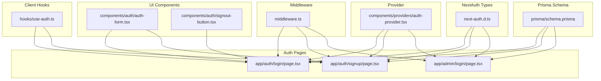

**Diagram sources**
- [middleware.ts:1-40](file://middleware.ts#L1-L40)
- [next-auth.d.ts:1-28](file://next-auth.d.ts#L1-L28)
- [components/providers/auth-provider.tsx:1-13](file://components/providers/auth-provider.tsx#L1-L13)
- [hooks/use-auth.ts:1-24](file://hooks/use-auth.ts#L1-L24)
- [app/auth/login/page.tsx:1-243](file://app/auth/login/page.tsx#L1-L243)
- [app/auth/signup/page.tsx:1-281](file://app/auth/signup/page.tsx#L1-L281)
- [app/admin/login/page.tsx:1-266](file://app/admin/login/page.tsx#L1-L266)
- [components/auth/auth-form.tsx:1-92](file://components/auth/auth-form.tsx#L1-L92)
- [components/auth/signout-button.tsx:1-57](file://components/auth/signout-button.tsx#L1-L57)
- [prisma/schema.prisma:15-35](file://prisma/schema.prisma#L15-L35)

**Section sources**
- [middleware.ts:1-40](file://middleware.ts#L1-L40)
- [next-auth.d.ts:1-28](file://next-auth.d.ts#L1-L28)
- [components/providers/auth-provider.tsx:1-13](file://components/providers/auth-provider.tsx#L1-L13)
- [hooks/use-auth.ts:1-24](file://hooks/use-auth.ts#L1-L24)
- [app/auth/login/page.tsx:1-243](file://app/auth/login/page.tsx#L1-L243)
- [app/auth/signup/page.tsx:1-281](file://app/auth/signup/page.tsx#L1-L281)
- [app/admin/login/page.tsx:1-266](file://app/admin/login/page.tsx#L1-L266)
- [components/auth/auth-form.tsx:1-92](file://components/auth/auth-form.tsx#L1-L92)
- [components/auth/signout-button.tsx:1-57](file://components/auth/signout-button.tsx#L1-L57)
- [prisma/schema.prisma:15-35](file://prisma/schema.prisma#L15-L35)

## Core Components
- Middleware with NextAuth: Enforces route protection and admin checks using a custom authorized callback.
- NextAuth Types: Extends session and JWT to include an admin flag for role-based checks.
- Provider Pattern: Wraps the app with a session provider to centralize authentication state.
- Client Hooks: Provides a simple hook to access user, loading state, and admin status.
- Auth Pages and Components: Implement login, signup, admin login, and logout flows.
- Prisma User Model: Defines the user entity and relations used by the system.

Key implementation references:
- Middleware route protection and admin checks: [middleware.ts:4-35](file://middleware.ts#L4-L35)
- Session and JWT types with admin flag: [next-auth.d.ts:4-27](file://next-auth.d.ts#L4-L27)
- Provider wrapping the app: [components/providers/auth-provider.tsx:6-11](file://components/providers/auth-provider.tsx#L6-L11)
- Hook returning user, loading, and admin status: [hooks/use-auth.ts:5-22](file://hooks/use-auth.ts#L5-L22)
- Login page handling credentials and redirects: [app/auth/login/page.tsx:44-83](file://app/auth/login/page.tsx#L44-L83)
- Signup page using server action and redirect: [app/auth/signup/page.tsx:27-66](file://app/auth/signup/page.tsx#L27-L66)
- Admin login enforcing admin emails: [app/admin/login/page.tsx:29-88](file://app/admin/login/page.tsx#L29-L88)
- Logout component using NextAuth signOut: [components/auth/signout-button.tsx:18-44](file://components/auth/signout-button.tsx#L18-L44)
- User model definition: [prisma/schema.prisma:15-35](file://prisma/schema.prisma#L15-L35)

**Section sources**
- [middleware.ts:4-35](file://middleware.ts#L4-L35)
- [next-auth.d.ts:4-27](file://next-auth.d.ts#L4-L27)
- [components/providers/auth-provider.tsx:6-11](file://components/providers/auth-provider.tsx#L6-L11)
- [hooks/use-auth.ts:5-22](file://hooks/use-auth.ts#L5-L22)
- [app/auth/login/page.tsx:44-83](file://app/auth/login/page.tsx#L44-L83)
- [app/auth/signup/page.tsx:27-66](file://app/auth/signup/page.tsx#L27-L66)
- [app/admin/login/page.tsx:29-88](file://app/admin/login/page.tsx#L29-L88)
- [components/auth/signout-button.tsx:18-44](file://components/auth/signout-button.tsx#L18-L44)
- [prisma/schema.prisma:15-35](file://prisma/schema.prisma#L15-L35)

## Architecture Overview
The authentication system integrates NextAuth.js with a custom admin flag stored in the session and JWT. Middleware protects routes and enforces admin-only access. The provider supplies session state to the UI, while client hooks and components encapsulate auth flows.

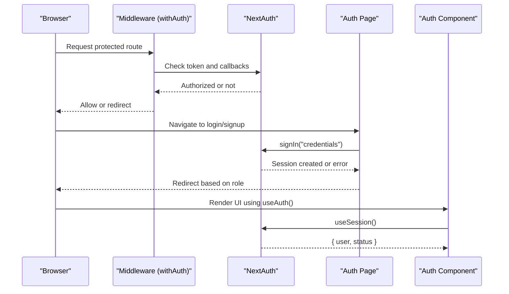

**Diagram sources**
- [middleware.ts:4-35](file://middleware.ts#L4-L35)
- [app/auth/login/page.tsx:44-83](file://app/auth/login/page.tsx#L44-L83)
- [hooks/use-auth.ts:5-22](file://hooks/use-auth.ts#L5-L22)
- [components/auth/auth-form.tsx:22-65](file://components/auth/auth-form.tsx#L22-L65)

## Detailed Component Analysis

### Middleware Route Protection
- Protects routes by requiring a valid token for sensitive paths.
- Explicitly allows authentication routes to avoid redirect loops.
- Enforces admin-only access for admin dashboards by checking the admin flag in the token.

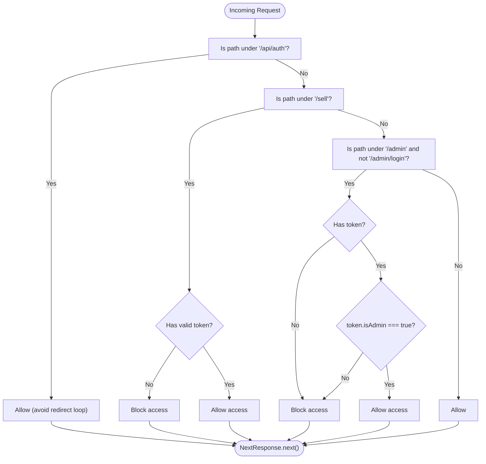

**Diagram sources**
- [middleware.ts:4-35](file://middleware.ts#L4-L35)

**Section sources**
- [middleware.ts:4-35](file://middleware.ts#L4-L35)

### NextAuth Types and Admin Flag
- Extends the session and JWT to include an admin flag for role checks.
- Ensures type-safe access to admin status in client components and middleware.

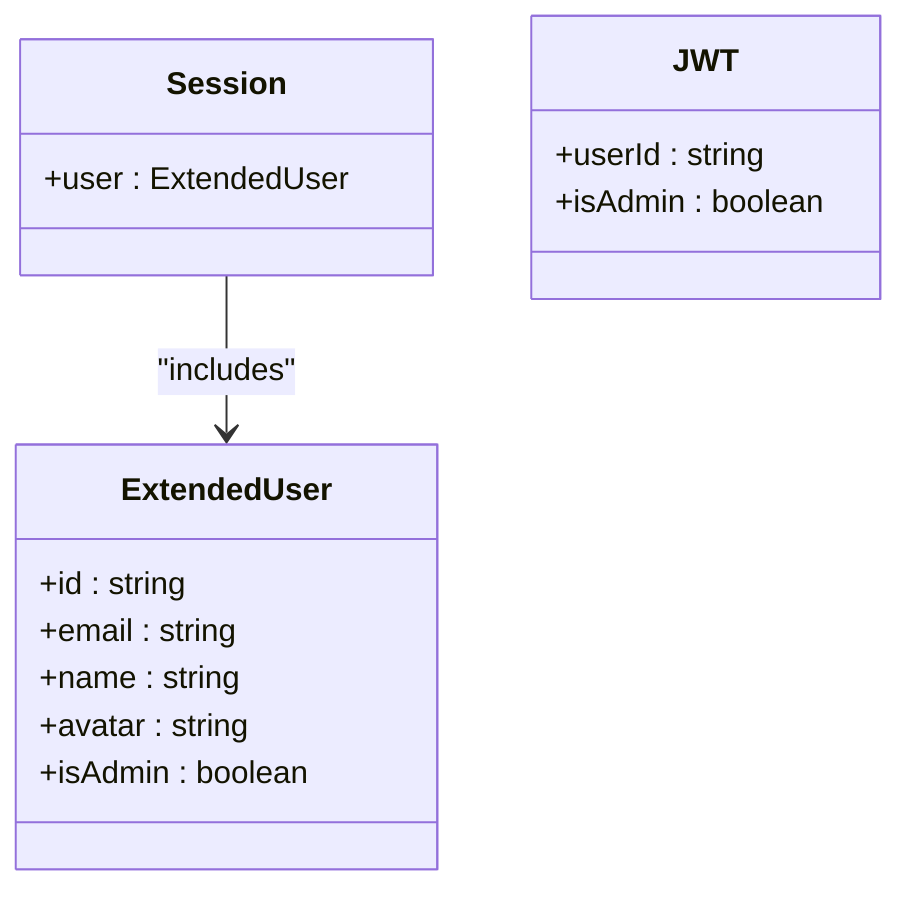

**Diagram sources**
- [next-auth.d.ts:4-27](file://next-auth.d.ts#L4-L27)

**Section sources**
- [next-auth.d.ts:4-27](file://next-auth.d.ts#L4-L27)

### Provider Pattern for Centralized Authentication State
- Wraps the application with a session provider so all components can consume session state via hooks.
- Ensures consistent session handling across the app.

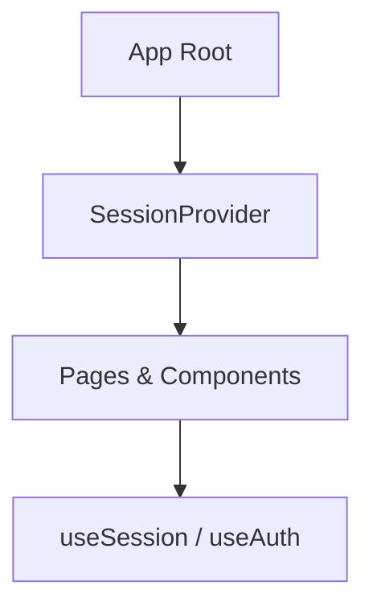

**Diagram sources**
- [components/providers/auth-provider.tsx:6-11](file://components/providers/auth-provider.tsx#L6-L11)
- [hooks/use-auth.ts:5-22](file://hooks/use-auth.ts#L5-L22)

**Section sources**
- [components/providers/auth-provider.tsx:6-11](file://components/providers/auth-provider.tsx#L6-L11)
- [hooks/use-auth.ts:5-22](file://hooks/use-auth.ts#L5-L22)

### Client Hook for Role-Based Rendering
- Returns user, loading state, and computed admin status based on the session and environment configuration.
- Enables role-aware UI rendering and conditional logic.

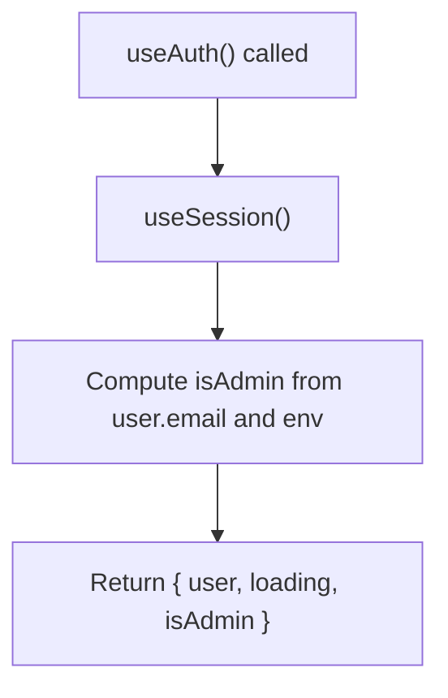

**Diagram sources**
- [hooks/use-auth.ts:5-22](file://hooks/use-auth.ts#L5-L22)

**Section sources**
- [hooks/use-auth.ts:5-22](file://hooks/use-auth.ts#L5-L22)

### Login Flow (Credentials)
- Validates credentials via NextAuth’s credentials provider.
- Redirects authenticated users to home or admin dashboard depending on admin flag.
- Displays errors via toast and prevents redirect loops.

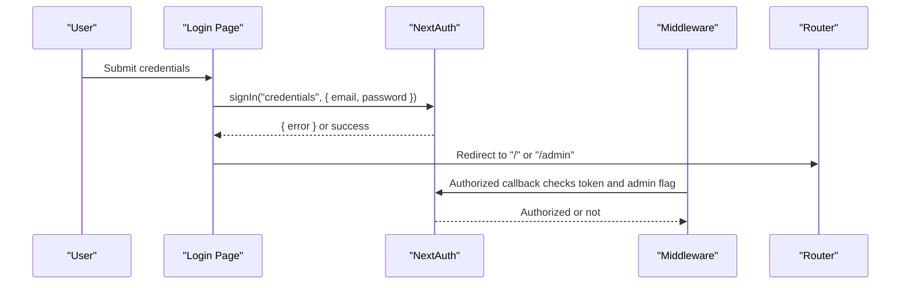

**Diagram sources**
- [app/auth/login/page.tsx:44-83](file://app/auth/login/page.tsx#L44-L83)
- [middleware.ts:10-32](file://middleware.ts#L10-L32)

**Section sources**
- [app/auth/login/page.tsx:44-83](file://app/auth/login/page.tsx#L44-L83)
- [middleware.ts:10-32](file://middleware.ts#L10-L32)

### Signup Flow (Server Action)
- Validates passwords and terms acceptance.
- Calls a server action to create the user and persist to the database.
- Redirects to a success page upon successful creation.

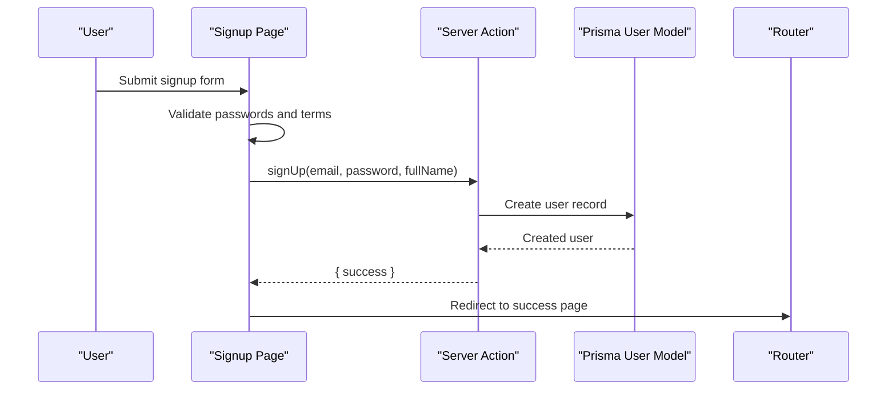

**Diagram sources**
- [app/auth/signup/page.tsx:27-66](file://app/auth/signup/page.tsx#L27-L66)
- [prisma/schema.prisma:15-35](file://prisma/schema.prisma#L15-L35)

**Section sources**
- [app/auth/signup/page.tsx:27-66](file://app/auth/signup/page.tsx#L27-L66)
- [prisma/schema.prisma:15-35](file://prisma/schema.prisma#L15-L35)

### Admin Login Flow
- Enforces admin-only access by verifying the email against configured admin emails.
- Uses NextAuth credentials provider for authentication.
- Redirects to admin dashboard on success.

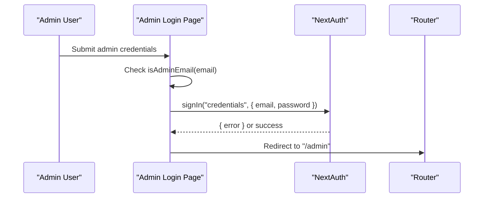

**Diagram sources**
- [app/admin/login/page.tsx:29-88](file://app/admin/login/page.tsx#L29-L88)

**Section sources**
- [app/admin/login/page.tsx:29-88](file://app/admin/login/page.tsx#L29-L88)

### Logout Flow
- Uses NextAuth’s signOut with redirect disabled to control navigation.
- Shows a toast and navigates to the home page, then refreshes to clear session state.

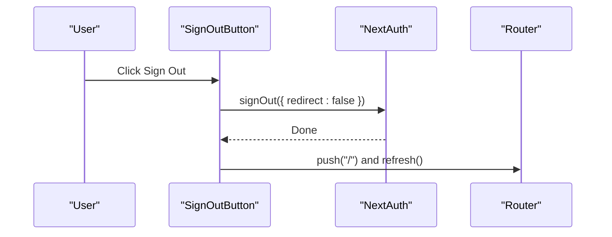

**Diagram sources**
- [components/auth/signout-button.tsx:18-44](file://components/auth/signout-button.tsx#L18-L44)

**Section sources**
- [components/auth/signout-button.tsx:18-44](file://components/auth/signout-button.tsx#L18-L44)

### Protected Routes and Guards
- Middleware acts as a guard for routes under /sell and /admin (excluding /admin/login).
- Pages can also guard themselves using client-side checks with useAuth() and redirects.

Practical examples:
- Protecting seller routes: [middleware.ts:19-22](file://middleware.ts#L19-L22)
- Admin-only dashboard: [middleware.ts:24-28](file://middleware.ts#L24-L28)
- Client-side guard example: [hooks/use-auth.ts:5-22](file://hooks/use-auth.ts#L5-L22)

**Section sources**
- [middleware.ts:19-22](file://middleware.ts#L19-L22)
- [middleware.ts:24-28](file://middleware.ts#L24-L28)
- [hooks/use-auth.ts:5-22](file://hooks/use-auth.ts#L5-L22)

### User Roles and Permissions
- Roles: buyer, seller, admin.
- Admin enforcement: Admin-only access to /admin (except login) via middleware and admin email list.
- Role-based rendering: useAuth() exposes isAdmin for UI decisions.
- User model: Minimal fields in Prisma schema; admin flag is derived from environment configuration and session/JWT.

Role enforcement references:
- Admin-only routes: [middleware.ts:24-28](file://middleware.ts#L24-L28)
- Admin email list usage: [app/admin/login/page.tsx:23-27](file://app/admin/login/page.tsx#L23-L27), [hooks/use-auth.ts:12-16](file://hooks/use-auth.ts#L12-L16)
- User model: [prisma/schema.prisma:15-35](file://prisma/schema.prisma#L15-L35)

**Section sources**
- [middleware.ts:24-28](file://middleware.ts#L24-L28)
- [app/admin/login/page.tsx:23-27](file://app/admin/login/page.tsx#L23-L27)
- [hooks/use-auth.ts:12-16](file://hooks/use-auth.ts#L12-L16)
- [prisma/schema.prisma:15-35](file://prisma/schema.prisma#L15-L35)

### Session Management and Token Management
- Session persistence: NextAuth manages cookies and session storage automatically.
- Token lifecycle: Middleware checks token validity and admin flag; client components rely on useSession/useAuth.
- Token augmentation: Admin flag is included in session and JWT via custom types.

References:
- Session provider: [components/providers/auth-provider.tsx:6-11](file://components/providers/auth-provider.tsx#L6-L11)
- Client session access: [hooks/use-auth.ts:5-22](file://hooks/use-auth.ts#L5-L22)
- Token admin flag: [next-auth.d.ts:11](file://next-auth.d.ts#L11), [next-auth.d.ts:25](file://next-auth.d.ts#L25)

**Section sources**
- [components/providers/auth-provider.tsx:6-11](file://components/providers/auth-provider.tsx#L6-L11)
- [hooks/use-auth.ts:5-22](file://hooks/use-auth.ts#L5-L22)
- [next-auth.d.ts:11](file://next-auth.d.ts#L11)
- [next-auth.d.ts:25](file://next-auth.d.ts#L25)

### Security Considerations
- Admin email list: Admin access is restricted to configured emails; verify environment variable correctness.
- Password reset: Not implemented in the referenced files; ensure secure reset flows are added.
- CSRF and session security: Use NextAuth defaults; keep secret keys secure and rotate periodically.
- Redirect safety: Middleware avoids redirect loops for auth routes; ensure custom routes follow similar patterns.

References:
- Admin email enforcement: [app/admin/login/page.tsx:42-46](file://app/admin/login/page.tsx#L42-L46)
- Auth route allowance: [middleware.ts:14-17](file://middleware.ts#L14-L17)

**Section sources**
- [app/admin/login/page.tsx:42-46](file://app/admin/login/page.tsx#L42-L46)
- [middleware.ts:14-17](file://middleware.ts#L14-L17)

## Dependency Analysis
The following diagram shows how authentication components depend on each other and external systems.

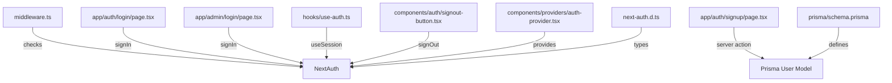

**Diagram sources**
- [middleware.ts:4-35](file://middleware.ts#L4-L35)
- [app/auth/login/page.tsx:44-83](file://app/auth/login/page.tsx#L44-L83)
- [app/auth/signup/page.tsx:27-66](file://app/auth/signup/page.tsx#L27-L66)
- [app/admin/login/page.tsx:29-88](file://app/admin/login/page.tsx#L29-L88)
- [hooks/use-auth.ts:5-22](file://hooks/use-auth.ts#L5-L22)
- [components/auth/signout-button.tsx:18-44](file://components/auth/signout-button.tsx#L18-L44)
- [components/providers/auth-provider.tsx:6-11](file://components/providers/auth-provider.tsx#L6-L11)
- [next-auth.d.ts:4-27](file://next-auth.d.ts#L4-L27)
- [prisma/schema.prisma:15-35](file://prisma/schema.prisma#L15-L35)

**Section sources**
- [middleware.ts:4-35](file://middleware.ts#L4-L35)
- [app/auth/login/page.tsx:44-83](file://app/auth/login/page.tsx#L44-L83)
- [app/auth/signup/page.tsx:27-66](file://app/auth/signup/page.tsx#L27-L66)
- [app/admin/login/page.tsx:29-88](file://app/admin/login/page.tsx#L29-L88)
- [hooks/use-auth.ts:5-22](file://hooks/use-auth.ts#L5-L22)
- [components/auth/signout-button.tsx:18-44](file://components/auth/signout-button.tsx#L18-L44)
- [components/providers/auth-provider.tsx:6-11](file://components/providers/auth-provider.tsx#L6-L11)
- [next-auth.d.ts:4-27](file://next-auth.d.ts#L4-L27)
- [prisma/schema.prisma:15-35](file://prisma/schema.prisma#L15-L35)

## Performance Considerations
- Minimize unnecessary redirects and re-renders by leveraging client-side guards and the session provider.
- Keep admin email lists small and static to reduce lookup overhead.
- Use middleware callbacks judiciously; avoid heavy computations inside authorized().
- Prefer server actions for signup to offload client-side work and ensure SSR-friendly behavior.

## Troubleshooting Guide
Common issues and resolutions:
- Redirect loops on auth routes: Ensure middleware allows /api/auth paths. See [middleware.ts:14-17](file://middleware.ts#L14-L17).
- Admin access denied: Confirm the email is in the admin list and environment variable is set. See [app/admin/login/page.tsx:42-46](file://app/admin/login/page.tsx#L42-L46).
- Login errors: Check credential submission and error messages from NextAuth. See [app/auth/login/page.tsx:57-59](file://app/auth/login/page.tsx#L57-L59).
- Logout not clearing state: Ensure redirect is disabled and router refresh is called. See [components/auth/signout-button.tsx:24-35](file://components/auth/signout-button.tsx#L24-L35).
- Type errors for session/JWT: Verify custom types align with session provider. See [next-auth.d.ts:4-27](file://next-auth.d.ts#L4-L27).

**Section sources**
- [middleware.ts:14-17](file://middleware.ts#L14-L17)
- [app/admin/login/page.tsx:42-46](file://app/admin/login/page.tsx#L42-L46)
- [app/auth/login/page.tsx:57-59](file://app/auth/login/page.tsx#L57-L59)
- [components/auth/signout-button.tsx:24-35](file://components/auth/signout-button.tsx#L24-L35)
- [next-auth.d.ts:4-27](file://next-auth.d.ts#L4-L27)

## Conclusion
Sendam Marketplace employs NextAuth.js with a custom admin flag, middleware-based route protection, and a provider pattern to deliver a robust authentication and authorization system. The design supports buyer, seller, and admin roles, with clear guards for sensitive routes and practical client hooks for role-based rendering. Administrators are restricted to a curated list of emails, and the system leverages session and token management for secure, scalable behavior. Future enhancements should include a secure password reset flow and continued adherence to environment-driven configuration for admin access.