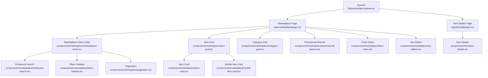
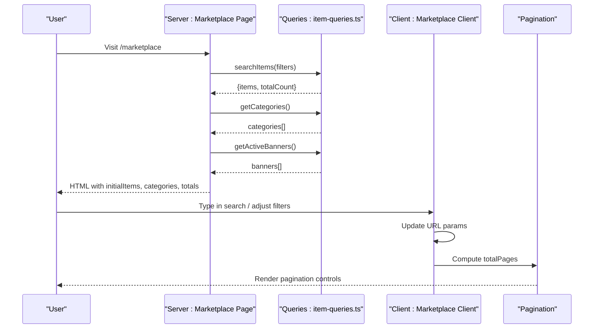
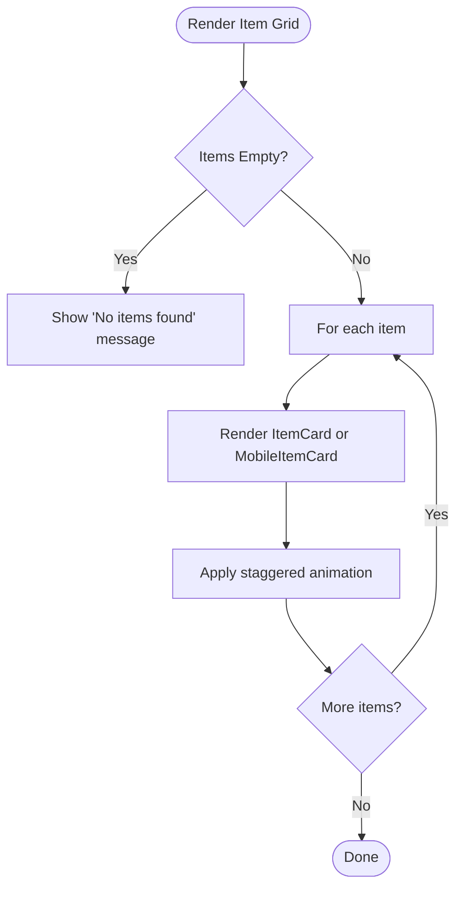
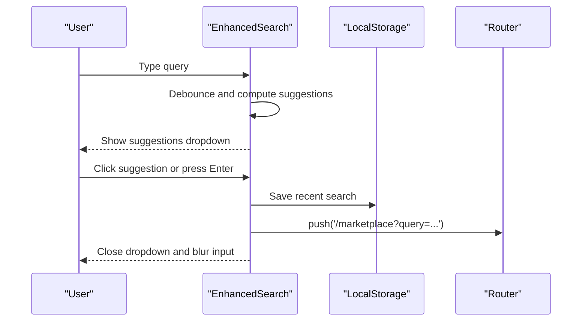
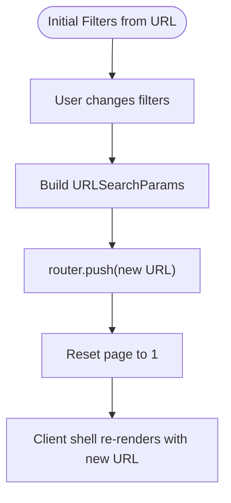
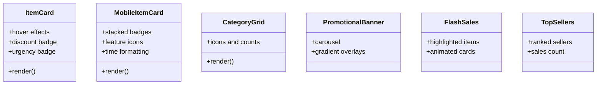
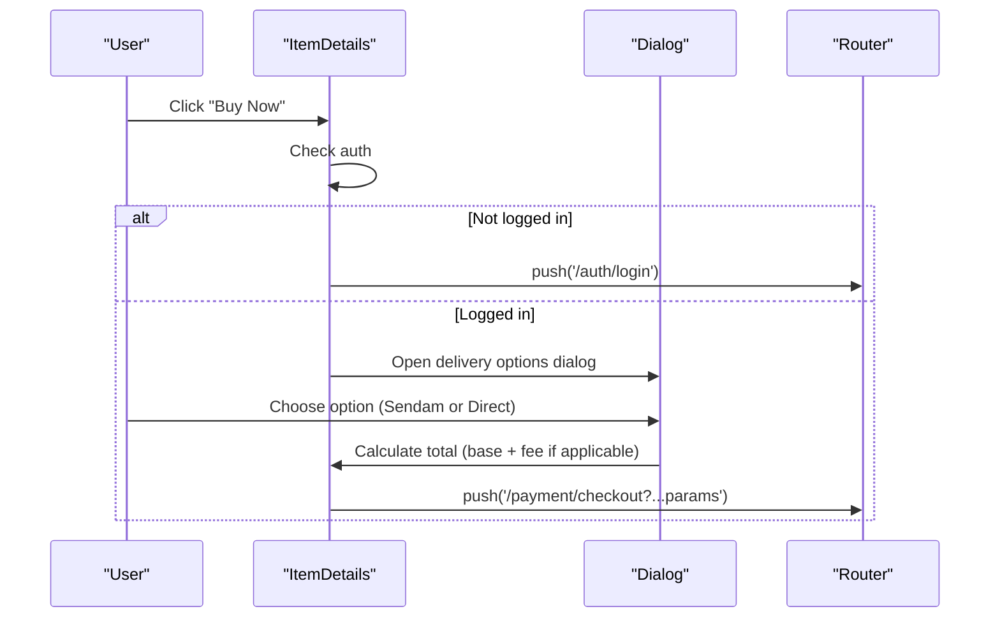
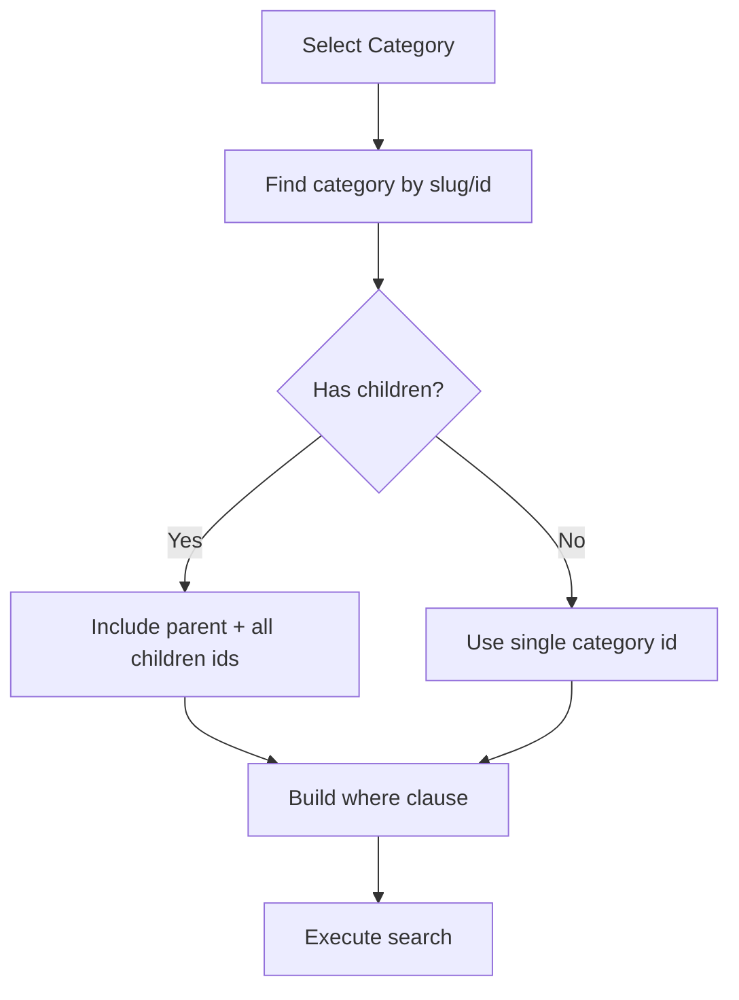
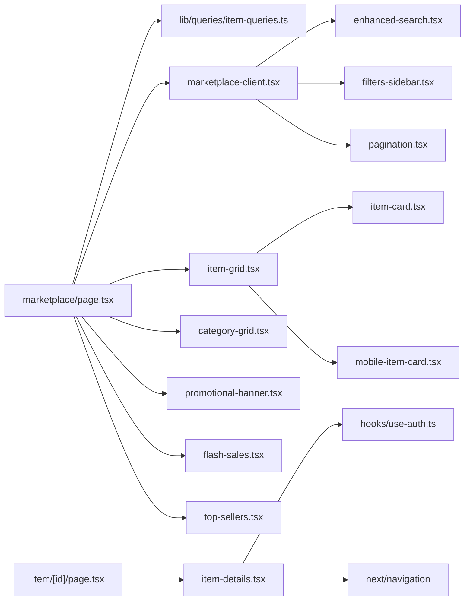

# Marketplace Features

<cite>
**Referenced Files in This Document**
- [app/marketplace/page.tsx](file://app/marketplace/page.tsx)
- [components/marketplace/marketplace-client.tsx](file://components/marketplace/marketplace-client.tsx)
- [components/marketplace/enhanced-search.tsx](file://components/marketplace/enhanced-search.tsx)
- [components/marketplace/filters-sidebar.tsx](file://components/marketplace/filters-sidebar.tsx)
- [components/marketplace/item-grid.tsx](file://components/marketplace/item-grid.tsx)
- [components/marketplace/item-card.tsx](file://components/marketplace/item-card.tsx)
- [components/marketplace/mobile-item-card.tsx](file://components/marketplace/mobile-item-card.tsx)
- [components/marketplace/category-grid.tsx](file://components/marketplace/category-grid.tsx)
- [components/marketplace/pagination.tsx](file://components/marketplace/pagination.tsx)
- [components/marketplace/promotional-banner.tsx](file://components/marketplace/promotional-banner.tsx)
- [components/marketplace/flash-sales.tsx](file://components/marketplace/flash-sales.tsx)
- [components/marketplace/top-sellers.tsx](file://components/marketplace/top-sellers.tsx)
- [app/item/[id]/page.tsx](file://app/item/[id]/page.tsx)
- [components/item/item-details.tsx](file://components/item/item-details.tsx)
- [lib/queries/item-queries.ts](file://lib/queries/item-queries.ts)
</cite>

## Table of Contents
1. [Introduction](#introduction)
2. [Project Structure](#project-structure)
3. [Core Components](#core-components)
4. [Architecture Overview](#architecture-overview)
5. [Detailed Component Analysis](#detailed-component-analysis)
6. [Dependency Analysis](#dependency-analysis)
7. [Performance Considerations](#performance-considerations)
8. [Troubleshooting Guide](#troubleshooting-guide)
9. [Conclusion](#conclusion)
10. [Appendices](#appendices)

## Introduction
This document explains the Sendam Marketplace features with a focus on item browsing, advanced search, filtering, and display components. It covers client-side rendering, responsive layouts, item details presentation, purchase workflows, category hierarchies, and promotional features. Practical guidance is included for implementing new features, customizing displays, and optimizing search performance, alongside user experience, accessibility, and mobile responsiveness considerations.

## Project Structure
The marketplace is organized around two primary areas:
- Server-rendered marketplace page orchestrating data fetching and layout
- Client-side marketplace shell managing filters, search, pagination, and responsive behavior
- Item details page with purchase workflow and seller information
- Supporting components for grids, cards, search suggestions, promotions, and pagination

**Diagram sources**
- [app/marketplace/page.tsx:1-162](file://app/marketplace/page.tsx#L1-L162)
- [components/marketplace/marketplace-client.tsx:1-172](file://components/marketplace/marketplace-client.tsx#L1-L172)
- [components/marketplace/enhanced-search.tsx:1-341](file://components/marketplace/enhanced-search.tsx#L1-L341)
- [components/marketplace/filters-sidebar.tsx:1-302](file://components/marketplace/filters-sidebar.tsx#L1-L302)
- [components/marketplace/item-grid.tsx:1-38](file://components/marketplace/item-grid.tsx#L1-L38)
- [components/marketplace/item-card.tsx:1-165](file://components/marketplace/item-card.tsx#L1-L165)
- [components/marketplace/mobile-item-card.tsx:1-187](file://components/marketplace/mobile-item-card.tsx#L1-L187)
- [components/marketplace/category-grid.tsx:1-41](file://components/marketplace/category-grid.tsx#L1-L41)
- [components/marketplace/pagination.tsx:1-122](file://components/marketplace/pagination.tsx#L1-L122)
- [components/marketplace/promotional-banner.tsx:1-110](file://components/marketplace/promotional-banner.tsx#L1-L110)
- [components/marketplace/flash-sales.tsx:1-63](file://components/marketplace/flash-sales.tsx#L1-L63)
- [components/marketplace/top-sellers.tsx:1-94](file://components/marketplace/top-sellers.tsx#L1-L94)
- [app/item/[id]/page.tsx](file://app/item/[id]/page.tsx#L1-L28)
- [components/item/item-details.tsx:1-395](file://components/item/item-details.tsx#L1-L395)
- [lib/queries/item-queries.ts:1-384](file://lib/queries/item-queries.ts#L1-L384)

**Section sources**
- [app/marketplace/page.tsx:1-162](file://app/marketplace/page.tsx#L1-L162)
- [components/marketplace/marketplace-client.tsx:1-172](file://components/marketplace/marketplace-client.tsx#L1-L172)

## Core Components
- Marketplace Page: Orchestrates server-side data fetching, environment checks, and renders both mobile and desktop layouts. It passes initial items, categories, filters, and totals to the client shell.
- Marketplace Client: Manages client-side state for filters, search, pagination, and responsive behavior. Provides mobile and desktop layouts, and integrates the enhanced search and filters.
- Item Grid and Cards: Render item listings with responsive grid layouts, discount badges, urgency indicators, and hover effects.
- Enhanced Search: Provides live suggestions, recent history, popular searches, and category shortcuts with keyboard and click interactions.
- Filters Sidebar: Supports hierarchical categories, price ranges, condition, features (negotiable, urgent, warranty, delivery), and location filters.
- Pagination: Handles page transitions and displays page info.
- Promotional Banner: Carousel banner for marketing campaigns.
- Flash Sales and Top Sellers: Highlighted sections for discounted items and top-performing sellers.

**Section sources**
- [app/marketplace/page.tsx:18-161](file://app/marketplace/page.tsx#L18-L161)
- [components/marketplace/marketplace-client.tsx:24-171](file://components/marketplace/marketplace-client.tsx#L24-L171)
- [components/marketplace/item-grid.tsx:8-37](file://components/marketplace/item-grid.tsx#L8-L37)
- [components/marketplace/item-card.tsx:18-164](file://components/marketplace/item-card.tsx#L18-L164)
- [components/marketplace/mobile-item-card.tsx:25-186](file://components/marketplace/mobile-item-card.tsx#L25-L186)
- [components/marketplace/enhanced-search.tsx:30-340](file://components/marketplace/enhanced-search.tsx#L30-L340)
- [components/marketplace/filters-sidebar.tsx:24-301](file://components/marketplace/filters-sidebar.tsx#L24-L301)
- [components/marketplace/pagination.tsx:12-121](file://components/marketplace/pagination.tsx#L12-L121)
- [components/marketplace/promotional-banner.tsx:30-109](file://components/marketplace/promotional-banner.tsx#L30-L109)
- [components/marketplace/flash-sales.tsx:10-62](file://components/marketplace/flash-sales.tsx#L10-L62)
- [components/marketplace/top-sellers.tsx:7-93](file://components/marketplace/top-sellers.tsx#L7-L93)

## Architecture Overview
The marketplace follows a server-first rendering pattern with a client-side shell for interactivity:
- Server-side marketplace page fetches items, categories, and banners, then streams HTML with a suspense boundary for skeleton loading.
- Client-side marketplace shell manages URL-based filters, search, and pagination, updating the URL and re-rendering content without full reloads.
- Item details page is client-rendered for purchase dialogs and interactive elements, while still leveraging server-provided item data.

**Diagram sources**
- [app/marketplace/page.tsx:50-62](file://app/marketplace/page.tsx#L50-L62)
- [lib/queries/item-queries.ts:119-278](file://lib/queries/item-queries.ts#L119-L278)
- [components/marketplace/marketplace-client.tsx:61-79](file://components/marketplace/marketplace-client.tsx#L61-L79)
- [components/marketplace/pagination.tsx:12-121](file://components/marketplace/pagination.tsx#L12-L121)

## Detailed Component Analysis

### Item Browsing System and Grid Layouts
- Responsive grid: The item grid adapts from 2–5 columns depending on screen size, with staggered animations per item for a polished entrance.
- Item cards display images, discount badges, urgency, condition, location, time posted, prices, and seller initials. Hover states and transitions enhance interactivity.
- Mobile item cards optimize for compact screens with stacked badges, concise labels, and clear affordances for online indicators and feature icons.

**Diagram sources**
- [components/marketplace/item-grid.tsx:8-37](file://components/marketplace/item-grid.tsx#L8-L37)
- [components/marketplace/item-card.tsx:18-164](file://components/marketplace/item-card.tsx#L18-L164)
- [components/marketplace/mobile-item-card.tsx:25-186](file://components/marketplace/mobile-item-card.tsx#L25-L186)

**Section sources**
- [components/marketplace/item-grid.tsx:8-37](file://components/marketplace/item-grid.tsx#L8-L37)
- [components/marketplace/item-card.tsx:18-164](file://components/marketplace/item-card.tsx#L18-L164)
- [components/marketplace/mobile-item-card.tsx:25-186](file://components/marketplace/mobile-item-card.tsx#L25-L186)

### Advanced Search Functionality
- Live suggestions: Generates category matches, popular searches, and contextual suggestions with a debounce delay.
- Local storage: Persists recent searches and allows clearing history.
- Keyboard and click: Enter to submit, Escape to dismiss, click-outside to close.
- Navigation: Clicking a suggestion navigates to the marketplace with appropriate filters.

**Diagram sources**
- [components/marketplace/enhanced-search.tsx:30-166](file://components/marketplace/enhanced-search.tsx#L30-L166)

**Section sources**
- [components/marketplace/enhanced-search.tsx:30-340](file://components/marketplace/enhanced-search.tsx#L30-L340)

### Filtering Mechanisms
- URL-driven filters: All filters are reflected in the URL; changing filters updates the URL and resets to the first page.
- Hierarchical categories: Parent-child categories are supported; selecting a parent includes all children.
- Feature toggles: Negotiable, urgent, warranty, and delivery filters are boolean switches.
- Sorting: Sort by newest, price ascending, or price descending.

**Diagram sources**
- [components/marketplace/marketplace-client.tsx:61-73](file://components/marketplace/marketplace-client.tsx#L61-L73)
- [lib/queries/item-queries.ts:164-188](file://lib/queries/item-queries.ts#L164-L188)

**Section sources**
- [components/marketplace/marketplace-client.tsx:47-73](file://components/marketplace/marketplace-client.tsx#L47-L73)
- [components/marketplace/filters-sidebar.tsx:24-59](file://components/marketplace/filters-sidebar.tsx#L24-L59)
- [lib/queries/item-queries.ts:119-278](file://lib/queries/item-queries.ts#L119-L278)

### Item Display Components
- ItemCard: Desktop-focused card with image overlay, badges, hover scaling, and concise metadata.
- MobileItemCard: Compact card optimized for small screens with stacked badges, time formatting, and feature icons.
- CategoryGrid: Renders category tiles with icons, counts, and animated entries.
- PromotionalBanner: Auto-rotating carousel with gradient overlays and call-to-action buttons.
- FlashSales: Highlighted sale items with animated entry and “limited time” messaging.
- TopSellers: Monthly top sellers with ranking badges and links.

**Diagram sources**
- [components/marketplace/item-card.tsx:18-164](file://components/marketplace/item-card.tsx#L18-L164)
- [components/marketplace/mobile-item-card.tsx:25-186](file://components/marketplace/mobile-item-card.tsx#L25-L186)
- [components/marketplace/category-grid.tsx:10-40](file://components/marketplace/category-grid.tsx#L10-L40)
- [components/marketplace/promotional-banner.tsx:30-109](file://components/marketplace/promotional-banner.tsx#L30-L109)
- [components/marketplace/flash-sales.tsx:10-62](file://components/marketplace/flash-sales.tsx#L10-L62)
- [components/marketplace/top-sellers.tsx:7-93](file://components/marketplace/top-sellers.tsx#L7-L93)

**Section sources**
- [components/marketplace/item-card.tsx:18-164](file://components/marketplace/item-card.tsx#L18-L164)
- [components/marketplace/mobile-item-card.tsx:25-186](file://components/marketplace/mobile-item-card.tsx#L25-L186)
- [components/marketplace/category-grid.tsx:10-40](file://components/marketplace/category-grid.tsx#L10-L40)
- [components/marketplace/promotional-banner.tsx:30-109](file://components/marketplace/promotional-banner.tsx#L30-L109)
- [components/marketplace/flash-sales.tsx:10-62](file://components/marketplace/flash-sales.tsx#L10-L62)
- [components/marketplace/top-sellers.tsx:7-93](file://components/marketplace/top-sellers.tsx#L7-L93)

### Item Details Page, Image Galleries, Seller Info, and Purchase Workflows
- Image gallery: Large hero image with thumbnail strip; clicking thumbnails updates the main image.
- Pricing and discounts: Original and discounted prices with percentage savings.
- Attributes: Structured details (brand, model, color, warranty, negotiable, etc.) with title-casing.
- Purchase workflow: Buy Now opens a modal with delivery options (Sendam-delivered vs. direct meet), pricing breakdown, and protection highlights.
- Seller info: Avatar, name, join date, and profile link.
- Accessibility: Proper labels, focus states, and semantic markup for interactive elements.

**Diagram sources**
- [components/item/item-details.tsx:37-63](file://components/item/item-details.tsx#L37-L63)
- [app/item/[id]/page.tsx](file://app/item/[id]/page.tsx#L12-L27)

**Section sources**
- [components/item/item-details.tsx:30-394](file://components/item/item-details.tsx#L30-L394)
- [app/item/[id]/page.tsx](file://app/item/[id]/page.tsx#L12-L27)

### Category Hierarchies and Promotional Features
- Hierarchical categories: Parent categories include all child categories when filtered; UI presents nested options.
- Promotions: Active banners carousel rotates automatically and pauses on interaction; Flash Sales highlights discounted items.

**Diagram sources**
- [lib/queries/item-queries.ts:164-188](file://lib/queries/item-queries.ts#L164-L188)
- [components/marketplace/category-grid.tsx:10-40](file://components/marketplace/category-grid.tsx#L10-L40)

**Section sources**
- [lib/queries/item-queries.ts:81-117](file://lib/queries/item-queries.ts#L81-L117)
- [components/marketplace/promotional-banner.tsx:30-109](file://components/marketplace/promotional-banner.tsx#L30-L109)
- [components/marketplace/flash-sales.tsx:10-62](file://components/marketplace/flash-sales.tsx#L10-L62)

## Dependency Analysis
Key dependencies and relationships:
- Marketplace Page depends on queries for items, categories, and banners.
- Marketplace Client depends on URL search params and router to manage filters and pagination.
- Item Grid and Cards depend on item data and shared utilities for formatting and badges.
- Enhanced Search depends on categories and local storage; it navigates via router.
- Item Details depends on auth hook and router for purchase flow.

**Diagram sources**
- [app/marketplace/page.tsx:1-16](file://app/marketplace/page.tsx#L1-L16)
- [components/marketplace/marketplace-client.tsx:3-11](file://components/marketplace/marketplace-client.tsx#L3-L11)
- [components/marketplace/enhanced-search.tsx:3-10](file://components/marketplace/enhanced-search.tsx#L3-L10)
- [components/marketplace/filters-sidebar.tsx:3-16](file://components/marketplace/filters-sidebar.tsx#L3-L16)
- [components/marketplace/item-grid.tsx:1-2](file://components/marketplace/item-grid.tsx#L1-L2)
- [components/marketplace/item-card.tsx:3-11](file://components/marketplace/item-card.tsx#L3-L11)
- [components/marketplace/mobile-item-card.tsx:3-10](file://components/marketplace/mobile-item-card.tsx#L3-L10)
- [components/marketplace/category-grid.tsx:1-4](file://components/marketplace/category-grid.tsx#L1-L4)
- [components/marketplace/promotional-banner.tsx:4-17](file://components/marketplace/promotional-banner.tsx#L4-L17)
- [components/marketplace/flash-sales.tsx:1-4](file://components/marketplace/flash-sales.tsx#L1-L4)
- [components/marketplace/top-sellers.tsx:1-5](file://components/marketplace/top-sellers.tsx#L1-L5)
- [app/item/[id]/page.tsx](file://app/item/[id]/page.tsx#L1-L4)
- [components/item/item-details.tsx:3-24](file://components/item/item-details.tsx#L3-L24)

**Section sources**
- [lib/queries/item-queries.ts:1-384](file://lib/queries/item-queries.ts#L1-L384)

## Performance Considerations
- Server-side data fetching: Parallel fetches for items, categories, and banners reduce initial load time.
- Pagination: Client computes total pages from server-provided counts to avoid extra queries.
- Debounced suggestions: A short debounce prevents excessive recomputation during typing.
- Image optimization: Next.js Image with sizing and lazy loading improves perceived performance.
- Skeleton loading: Suspense boundary ensures fast TTFB with skeleton UI.
- Minimal client state: Filters and pagination are URL-driven, reducing memory overhead.

[No sources needed since this section provides general guidance]

## Troubleshooting Guide
- Database connectivity: The marketplace page catches errors and falls back to a no-database UI.
- Not found items: The item details page redirects to a 404 if the item does not exist or is not approved.
- Filter persistence: Ensure URL parameters are correctly parsed and applied; verify that clearing filters resets to defaults.
- Search history: Confirm local storage availability and permissions; provide a clear action to reset history.
- Purchase flow: Verify authentication state before opening the buy dialog; ensure checkout parameters include all required fields.

**Section sources**
- [app/marketplace/page.tsx:44-70](file://app/marketplace/page.tsx#L44-L70)
- [app/item/[id]/page.tsx](file://app/item/[id]/page.tsx#L15-L17)
- [components/marketplace/enhanced-search.tsx:180-187](file://components/marketplace/enhanced-search.tsx#L180-L187)
- [components/marketplace/filters-sidebar.tsx:47-59](file://components/marketplace/filters-sidebar.tsx#L47-L59)
- [components/item/item-details.tsx:37-43](file://components/item/item-details.tsx#L37-L43)

## Conclusion
The Sendam Marketplace combines efficient server-side rendering with a robust client-side shell to deliver a responsive, searchable, and highly filterable shopping experience. Its modular components enable easy customization, while thoughtful UX patterns and accessibility features improve usability across devices. The item details page and purchase workflow integrate seamlessly with the browsing experience, and promotional features help drive engagement.

[No sources needed since this section summarizes without analyzing specific files]

## Appendices

### Implementing New Marketplace Features
- Add a new filter:
  - Extend the filters object in the marketplace page and pass it to the client shell.
  - Update the filters sidebar to render the new control and persist its value in URL params.
  - Modify the search query builder to include the new filter in the where clause.
  - Reference: [app/marketplace/page.tsx:28-42](file://app/marketplace/page.tsx#L28-L42), [components/marketplace/filters-sidebar.tsx:24-59](file://components/marketplace/filters-sidebar.tsx#L24-L59), [lib/queries/item-queries.ts:119-278](file://lib/queries/item-queries.ts#L119-L278)
- Customize item displays:
  - Adjust ItemCard or MobileItemCard props and styles to reflect new attributes or badges.
  - Reference: [components/marketplace/item-card.tsx:18-164](file://components/marketplace/item-card.tsx#L18-L164), [components/marketplace/mobile-item-card.tsx:25-186](file://components/marketplace/mobile-item-card.tsx#L25-L186)
- Optimize search performance:
  - Use debounced suggestions and limit suggestion counts.
  - Ensure category slugs and IDs are indexed in the database.
  - Reference: [components/marketplace/enhanced-search.tsx:70-138](file://components/marketplace/enhanced-search.tsx#L70-L138), [lib/queries/item-queries.ts:164-188](file://lib/queries/item-queries.ts#L164-L188)

### Accessibility and Mobile Responsiveness
- Use semantic HTML and proper labels for interactive elements.
- Ensure sufficient color contrast for badges and CTAs.
- Test keyboard navigation and focus outlines.
- Validate touch targets and spacing on small screens.
- Reference: [components/item/item-details.tsx:30-394](file://components/item/item-details.tsx#L30-L394), [components/marketplace/item-card.tsx:18-164](file://components/marketplace/item-card.tsx#L18-L164), [components/marketplace/mobile-item-card.tsx:25-186](file://components/marketplace/mobile-item-card.tsx#L25-L186)